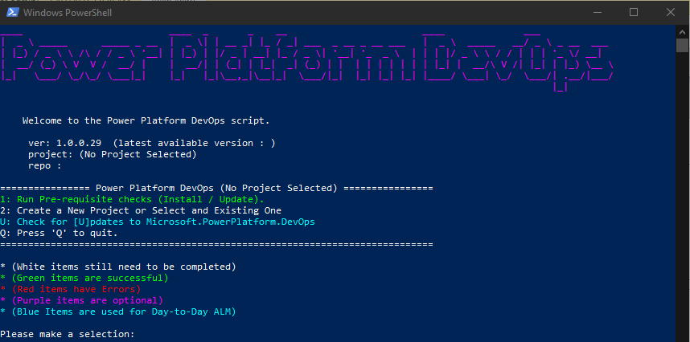

# Documentation and user guide

[For a detailed instruction on the toolset, link via 365.training](https://365.training/Player/VideoPlayer/8e5e028b-bb03-4c27-bba3-8e3edda5c76e/b4b58a35-9209-eb11-a813-000d3a58ba85)

## 1 Prerequisites:

```
This needs to be refined to include links to relevant MS docs to set these things up.
Need to define which are optional
```

* Administrative access on your installation device
* PowerShell
  * Minimum version 5.x 
  * Ability to run PowerShell as an administrator on your installation device
  * [🔗 Install PowerShell](https://docs.microsoft.com/en-us/powershell/scripting/install/installing-powershell?view=powershell-7.1) 
* Azure DevOps
  * A member of the Project Administrator team (or greater)
  * [🔗 Microsoft Docs - Azure DevOps Administrator Management](https://docs.microsoft.com/en-us/azure/devops/user-guide/project-admin-tutorial?view=azure-devops)
* Microsoft 365
  * Permissions to create Dataverse environments
* Dataverse
  * System Administrator in your Dataverse environment(s) 
  * [🔗 Microsoft Docs - Create Environment](https://docs.microsoft.com/en-us/power-platform/admin/create-environment)
* If using Azure KeyVault and/or Service Principles you need contributor or administrator access in Azure
  * KeyVault must be configured before using the tool to create
* Configure application user in DataVerse Environments

## 2 Install the PowerShell Module and Run Pre-Requisites Check

The follow should be ran the first time you install the module on your machine.

| # | Action | PowerShell Cmdlet | Steps |
|--|--|--|--|
| 1 | Installing the module | `Install-Module -Name Microsoft.PowerPlatform.DevOps` | 1. Run 'Windows PowerShell' as an administrator<br>2. Run the cmdlet <br>_Note: Other installation methods can be found at https://www.powershellgallery.com/packages/Microsoft.PowerPlatform.DevOps_ |
| 2 | Open the module       | `Invoke-PowerPlatformDevOps` | 1. Run the cmdlet <br>_Note: It is recommended that you open PowerShell as administrator_ |
| 3 | Run pre-requisites  | `1: Run Pre-requisite checks (Install / Update)`      | Run the pre requisite checks by entering option `1` and pressing `<Enter>`<br> |

## 3 Invoking and Updating the Module
| Action | PowerShell Cmdlet | Steps |
|--|--|--|
| **Installing the module** | `Install-Module -Name Microsoft.PowerPlatform.DevOps` | 1. Run 'Windows PowerShell' as an administrator<br>2. Run the cmdlet <br>_Note: Other installation methods can be found at https://www.powershellgallery.com/packages/Microsoft.PowerPlatform.DevOps_ |
| **Using the module** | `Invoke-PowerPlatformDevOps` | 1. Run the cmdlet <br>_Note: It is recommended that you open PowerShell as administrator_ |
| **Find what version you have installed**  | `Get-InstalledModule Microsoft.PowerPlatform.DevOps` | 1. Run the cmdlet <br>_Note: Your current running version is also specified on the top of the screen when you invoke the module_ |  |
| **Update your version** | `Update-Module Microsoft.PowerPlatform.DevOps` | 1. Run the cmdlet |  |
| **Update your version** | `[U]` | 1. `Invoke-PowerPlatformDevOps` <br>2. Select `[U]` to Update your tool |  |

## 4 Using the tool

| # | Step | Description |
|--|--|--|
| 1 | Run Pre-requisite checks (Install / Update) | This step installs the relevant dependencies required by the tool  (e.g. git, node.js, etc. )|
| 2 | Create a New Project or Select and Existing One | To set up and connect the project for use in the tool |
| 3 | Configure Azure DevOps (ADO Org:  \| ADO Project:  \| git Repo: <<your repo name>> ) | Create/connect to the Azure DevOps Project |
| 4 | Add New D365 / CDS Solution |  |
| 5 | Configure Continuous Deployment (CI/CD Environment : Staging01 \| CI/CD URL : https://example.crm6.dynamics.com) |  |
| A | Enable [A]zure Resource Management Deployment |  |
| F | Add Azure [F]unction App Project |
| D | Add Additional [D]365 / CDS Solutions |
| E | [E]xport & Unpack Solution to Source Control |
| S | Commit and [S]ync changes to Source Control |
| V | [V]iew current change log for Source Control |
| T | Add Additional Deployment Environment [T]arget |
| U | Check for [U]pdates to Microsoft.PowerPlatform.DevOps |
| Q | Press 'Q' to quit |

## Files

You can find detailed explanation of each file and its configuration here:

| File                                | Description                                                  |
| ----------------------------------- | ------------------------------------------------------------ |
| [build.yaml](3%20Files/build.yaml.md) | Defines the Azure DevOps pipeline including build, test and deployment stages |
| [config.json](3%20Files/config.json.md) | Defines configuration properties for a specific solution.<br>Consumed by the PowerShell scripts. |
| [deployPackages.json](3%20Files/deployPackages.json.md) | Defines which Dataverse solutions are deployed, to which Dataverse environments, and how (data migration, pre actions and post actions) |
| [project.json](3%20Files/project.json.md) | Configuration file used by the module to determine which solutions are prepared for export and import |

